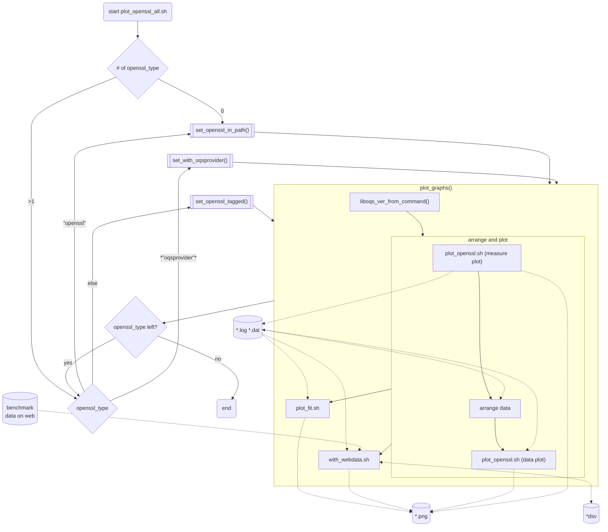
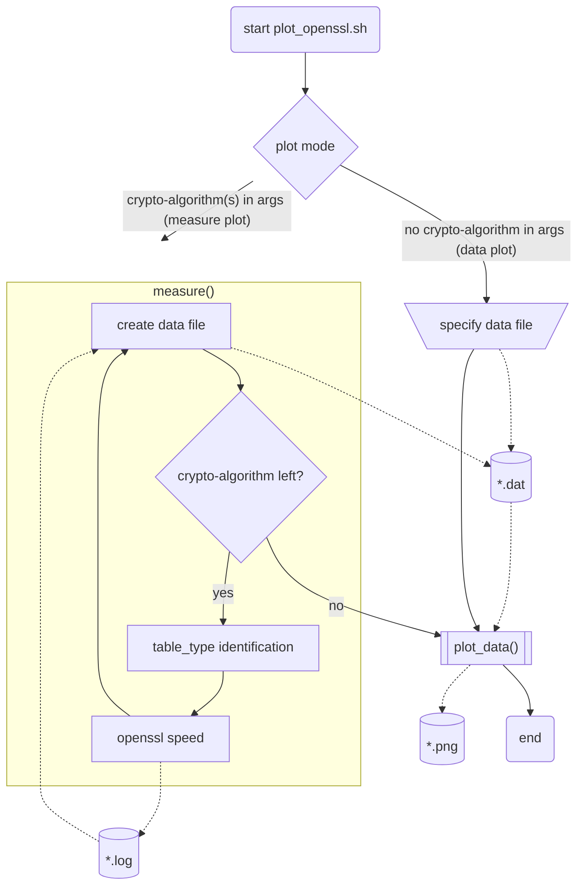
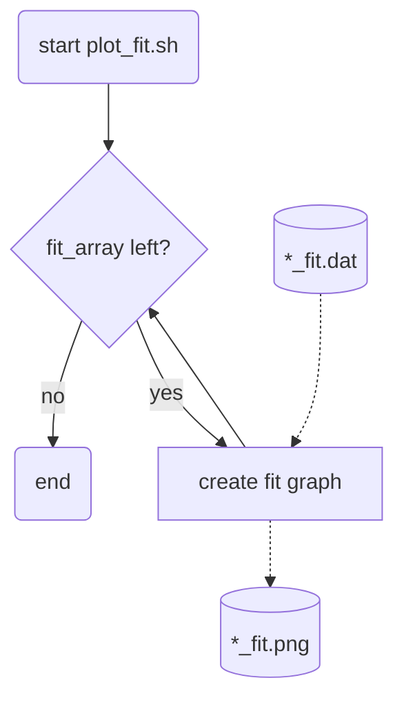
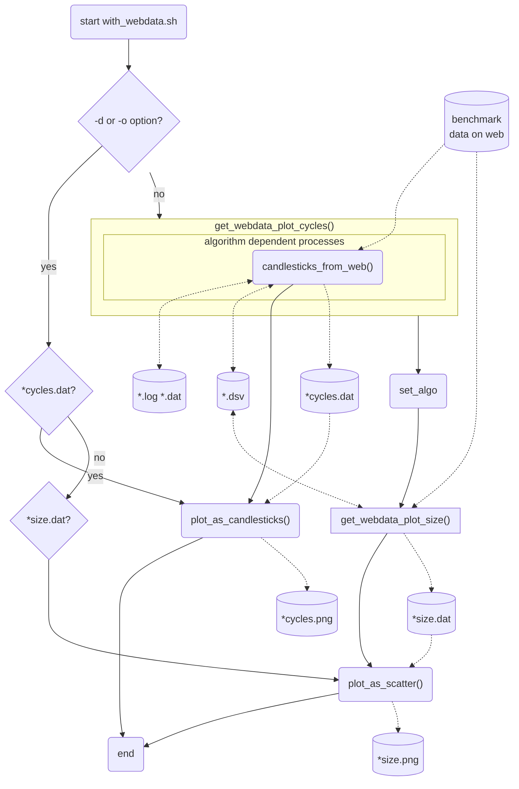

# Flowcharts (high level)

## plot_openssl_all.sh

```mermaid
%% dummy line

flowchart TB
  node_1("start plot_openssl_all.sh")
  node_2{"#35; of openssl_type"}
  node_3[["set_openssl_in_path()"]]
  node_5[["set_openssl_tagged()"]]
  node_8[["set_with_oqsprovider()"]]
  node_4{"openssl_type"}
  node_7{"openssl_type left?"}
  node_9("end")

  node_3 ~~~ node_8
  node_8 ~~~ node_5
  node_5 ~~~ node_9

  data_1[("*.log *.dat")]
  data_2[("*.png")]
  data_3[("*dsv")]
  data_4[("benchmark\ndata on web")]

  data_1 ~~~ data_4
  sub1_0 ~~~ data_1

  subgraph sub1 ["plot_graphs()"]
    sub1_0["liboqs_ver_from_command()"]
    sub1_3["with_webdata.sh"]
    sub1_2["plot_fit.sh"]

    sub1_2 ~~~ sub1_3

    subgraph sub1-1 ["arrange and plot"]
     sub1_1["plot_openssl.sh (measure plot)"]
     sub1_10["arrange data"]
     sub1_11["plot_openssl.sh (data plot)"]
    end

    sub1_1 --> sub1_10
    sub1_10 --> sub1_11
    sub1-1 --> sub1_2
    sub1-1 --> sub1_3
    sub1_0 --> sub1-1
  end

  node_1 --> node_2
  node_2 --"0"--> node_3
  node_2 --"#gt;1"--> node_4
  node_4 --"#quot;openssl#quot;"--> node_3
  node_4 --"else"--> node_5
  node_5 --> sub1
  sub1 --> node_7
  node_7 --"yes"--> node_4
  node_3 --> sub1
  node_4 --"*#quot;oqsprovider#quot;*"--> node_8
  node_8 --> sub1
  node_7 --"no"--> node_9

  sub1_1 -.-> data_1
  data_1 -.-> sub1_2
  data_1 -.-> sub1_3
  data_1 -.-> sub1_11
  data_1 <-.-> sub1_10
  sub1_2 -.-> data_2 
  sub1_3 -.-> data_2
  sub1_11 -.-> data_2

  sub1_1 -.-> data_2
  data_4 -.-> sub1_3
  sub1_3 <-.-> data_3
```

## plot_openssl.sh

```mermaid
flowchart TB
  node_1("start plot_openssl.sh")
  node_2{"plot mode"}
  node_3[["plot_data()"]]
  node_5[("*.dat")]
  node_6[("*.png")]
  node_9[("*.log")]
  node_7[\"specify data file"/]
  node_10("end")
  node_11["create data file"]
  node_1 --> node_2
  node_2 --"crypto-algorithm(s) in args (measure plot)"--> sub1
  node_3 -.-> node_6
  node_7 -.-> node_5
  node_2 --"no crypto-algorithm in args (data plot)"--> node_7
  node_8 --"yes"--> sub1_2
  node_3 --> node_10
  node_5 -.-> node_3
  node_8 --"no"--> node_3
  node_9 -.-> node_11
  node_11 -.-> node_5
  subgraph sub1 ["measure()"]
    direction TB
    sub1_2["table_type identification"]
    sub1_1["openssl speed"]
    node_8{"crypto-algorithm left?"}
    node_11["create data file"]
  end
    sub1_1 -.-> node_9
    node_7 --> node_3
    node_11 --> node_8
    sub1_1 --> node_11
    sub1_2 --> sub1_1
```

## plot_fit.sh

```mermaid
flowchart TB
  node_1("start plot_fit.sh")
  node_7{"fit_array left?"}
  node_2("end")
  node_3["create fit graph"]
  node_4[("*_fit.png")]
  node_5[("*_fit.dat")]
  node_1 --> node_7
  node_7 --"no"--> node_2
  node_7 --"yes"--> node_3
  node_3 --> node_7
  node_3 -.-> node_4
  node_5 -.-> node_3
```

## data_from_web/with_webdata.sh

```mermaid
flowchart TB
  node_1("start with_webdata.sh")
  node_2("end")
  node_3{"-d or -o option?"}
  node_4{"*cycles.dat?"}
  node_5{"*size.dat?"}
  node_6("plot_as_candlesticks()")
  node_7("plot_as_scatter()")

  data_7[("benchmark\ndata on web")]
  data_10[("*.dsv")]
  data_1[("*.log *.dat")]
  data_2[("*cycles.dat")]
  data_3[("*cycles.png")]
  data_4[("*size.dat")]
  data_5[("*size.png")]

  subgraph sub1 ["get_webdata_plot_cycles()"]
    direction TB
    subgraph sub2 ["algorithm dependent processes"]
      direction TB
      node_10("candlesticks_from_web()")
    end
  end

  subgraph sub10 ["get_webdata_plot_size()"]
    direction TB
  end

  node_20("set_algo")

  sub1 --> node_20
  node_20 --> sub10

  node_10 <-.-> data_1
  data_2 -.-> node_6
  node_1 --> node_3
  node_3 --"no"--> sub1
  node_6 --> node_2
  node_10 <-.-> data_10
  node_10 --> node_6
  node_10 -.-> data_2
  node_6 -.-> data_3
  data_7 -.-> node_10
  node_3 --"yes"--> node_4
  node_4 --"yes"--> node_6
  node_4 --"no"--> node_5
  node_5 --> node_7
  node_7 --> node_2
  sub10 --> node_7
  data_7 -.-> sub10
  sub10 -.-> data_4
  data_4 -.-> node_7
  node_7 -.-> data_5
  data_10 <-.-> sub10
```
