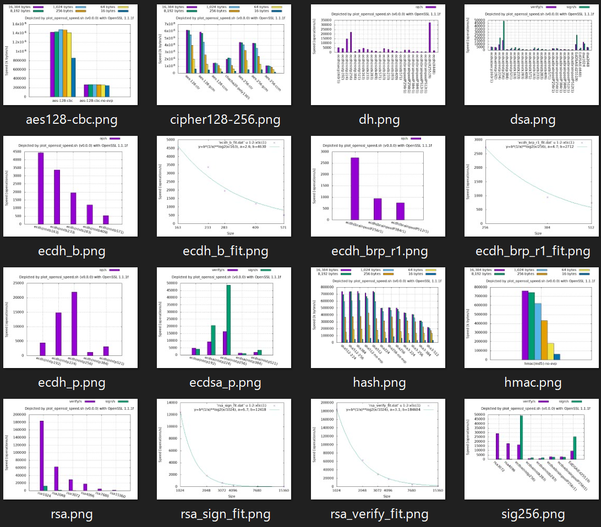
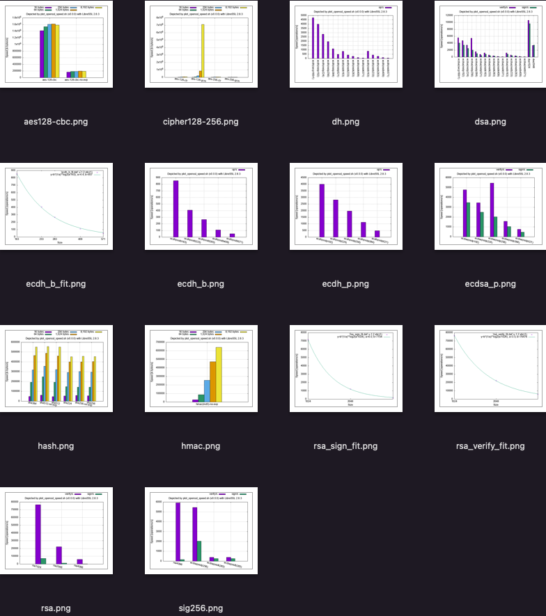
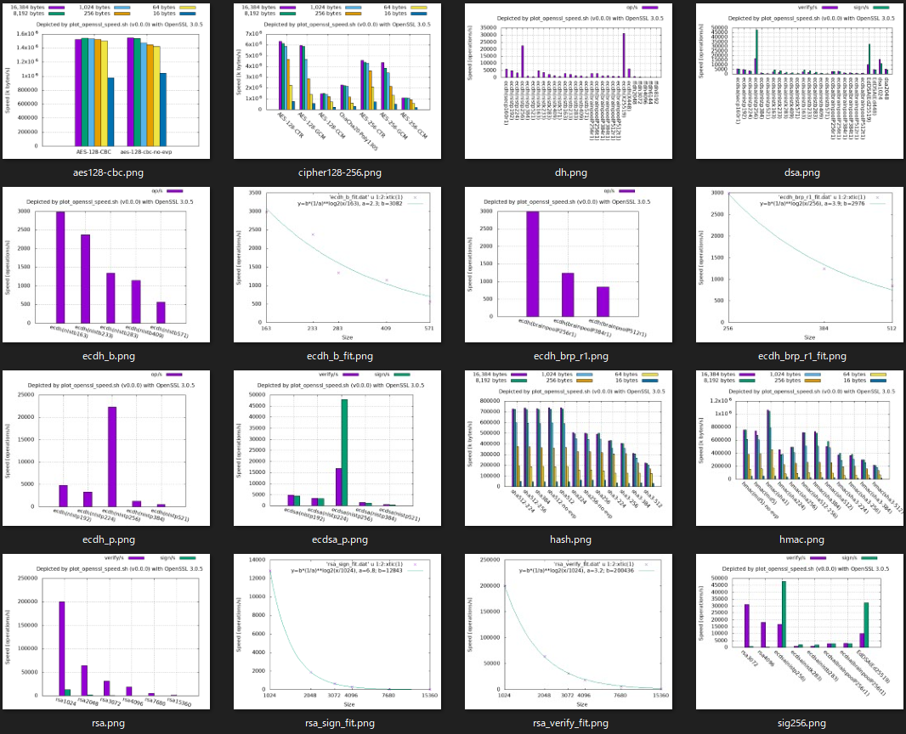
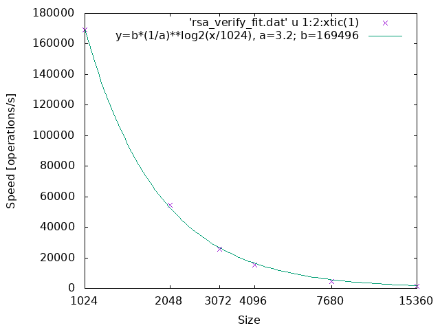
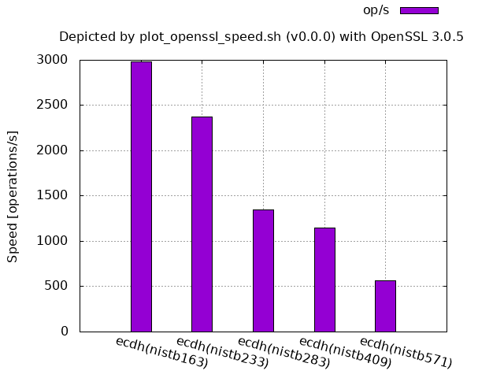
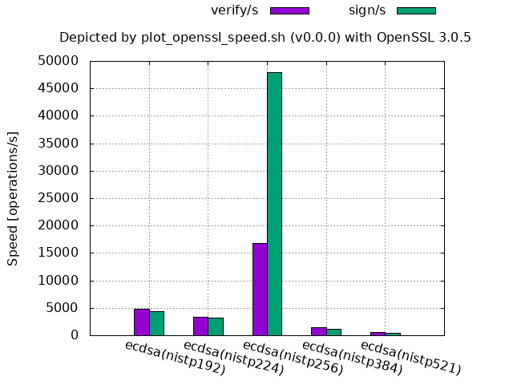
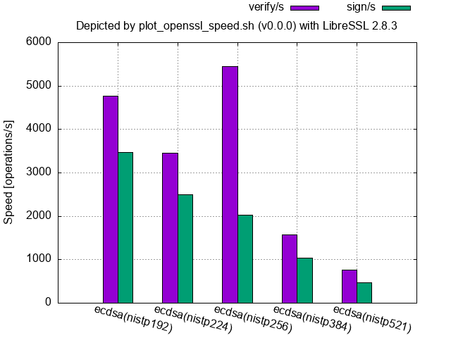
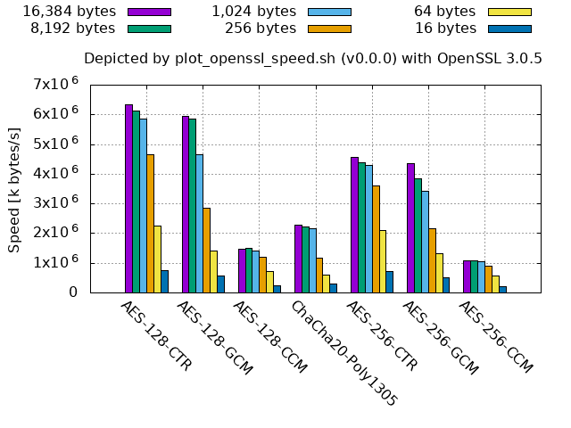
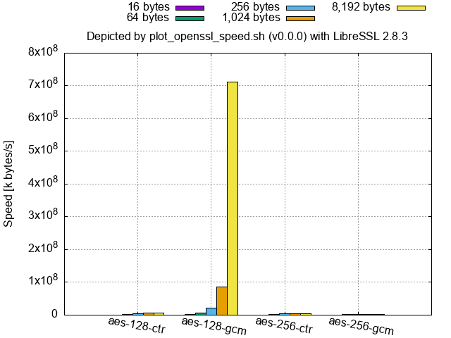

# 複数の `openssl speed` 測定結果を簡単にグラフ描画する方法

[English ](./README.md)
<!--
[English](./README.md) 
-->

## 前準備

1. 必要なコマンドのインストール
    * Debian/Ubuntu の場合:

        ```console
        sudo apt install gnuplot git openssl make gcc gcc-mingw-w64-x86-64
        ```

        > * `openssl` は実行PATH上の openssl を使う場合に必要
        > * `make gcc` は openssl をソースファイルから make する場合に必要
        > * `gcc-mingw-w64-x86-64` は MinGW で openssl.exe を作る場合に必要

    * macOS の場合:
      1. Command Line Tools のインストール

          ターミナル上で Command Line Tools が提供しているコマンド(例えば以下など)を打ち込み、指示に従う。

          ```zsh
          gcc
          ```

      1. [Homebrew](https://brew.sh/)をインストールし、以下を実行

          ```zsh
          brew install gnuplot coreutils mingw-w64
          ```

          > * `coreutils` は `realpath` コマンドをインストールするために必要
          > * `mingw-w64` は MinGW で openssl.exe を作る場合に必要

      1. シェルを Bash に変更

          ```zsh
          chsh -s /bin/bash
          ```

1. スクリプトのダウンロードとフォルダへの移動

    ```bash
    git clone https://github.com/KazKobara/plot_openssl_speed.git
    cd plot_openssl_speed
    ```

1. ヘルプと使い方の表示

    ```bash
    ./plot_openssl_speed_all.sh -h
    ```

## 実行PATH上のopensslコマンドの測定結果を描画する場合

```bash
./plot_openssl_speed_all.sh -s 1
```

> * オプションの `-s 1` は、各暗号アルゴリズムの測定時間を1秒に短縮するためのものです。
>   * 全体の傾向をつかめ、バラツキの小さな計測を行う際には指定せずご実行下さい。
>   * 以下の図は指定せずに実行した結果になります。
> * LibreSSL に対しては、(少なくとも 2.8.3 の時点においては) `openssl speed` コマンドが `-seconds` オプションを有しておらずエラーとなるため指定しても無視されます。

上記コマンドを実行すると、以下のように表示メッセージの最後に、グラフ画像ファイルやその元になったデータファイルなどが格納されたフォルダ情報が表示されます。

```text
Results are in:
  ./tmp/default_openssl_1.1.1f/graphs/
```

> WSL (Windows Subsystem for Linux) を使用している場合、例えば `Ubuntu-20.04` の `/home/` ディレクトリへは Windows OS のファイルエクスプローラから、以下のアドレスで移動できます。

```text
\\wsl$\Ubuntu-20.04\home\
```

グラフ画像の一覧は、例えば、ファイルエクスプローラの場合、以下のように「表示」タブで「特大アイコン」を選択し、「グループ化」で「種類」を選択すると表示させることができます。


<!--  -->

格納されたグラフ画像一覧の例(PATH上の openssl 1.1.1f):

<!--  -->

格納されたグラフ画像一覧の例(PATH上の LibreSSL 2.8.3):

<!--  -->

## 指定したバージョン(tag)をコンパイルし得たopensslコマンドの測定結果を描画する場合

例えば、[tag](https://github.com/openssl/openssl) として `openssl-3.0.7` のソースコードからその実行環境用にコンパイルした `openssl` コマンドでの測定結果と、それを MinGW (x86_64-w64-mingw32-gcc) でクロスコンパイルした Windows OS 用 `openssl.exe` での測定結果も図示する場合。

```bash
./plot_openssl_speed_all.sh -s 1 openssl-3.0.7 openssl-3.0.7-mingw
```

<!--
```bash
bash -c "./plot_openssl_speed_all.sh -s 1 OpenSSL_1_1_1q openssl-3.0.7 OpenSSL_1_1_1q-mingw openssl-3.0.7-mingw"
```
-->

> * tagの後ろに`-mingw`を付けることで Windowsバイナリ openssl.exe が make され、WSL上ではその測定結果のグラフ画像も保存されます。WSL以外では Windowsバイナリ実行環境も構築する必要があります。
> * 以下の例で示しております openssl-3.0.5 には[脆弱性](https://www.openssl.org/news/vulnerabilities.html)があります。修正済または最新の [OpenSSL](https://github.com/openssl/openssl) (またはその代替プログラム)をご使用下さい。

格納されたグラフ画像一覧の例(ソースからコンパイルした openssl-3.0.5):

<!--  -->

## グラフから読み取れることと補足

処理速度は様々な要因により変わるため、あくまで[こちらの測定環境](#測定環境)における参考です。また、処理速度が速いというだけで、**脆弱性**な暗号アルゴリズムや、各用途で求められる**セキュリティレベルを満たさないアルゴリズム**を選択しないようにご注意下さい。

> どのような用途においてどのようなアルゴリズムを用いるべきかなどにつきましては、もし必要でしたら勉強会などに呼んで頂ければ解説致します。

### 非対称鍵暗号方式(デジタル署名、暗号鍵共有方式など)

まずは、一般的な傾向の例を以下の図に示します。各線グラフは、対応する棒グラフの暗号アルゴリズム名中のサイズ（非対称鍵暗号アルゴリズムを構成する有限体または環のビット長）と処理速度との関係を示し、各線グラフ中の変数 `a` の値は、サイズが2倍になった場合に処理速度が 1/a になる場合の a の値を表します。

RSA:


<!--  -->


<!--


-->

2の拡大体上のECDH:


<!--


-->

素体上のECDH(brainpool):


<!--


-->

いずれの図からも、サイズが大きくなるにつれ処理速度が遅くなることを確認できます。

次に、この傾向から外れている例を示します。

ECDSA/ECDH(素体上のNISTカーブ, OpenSSL 3.0.5):


<!--


-->

ECDSA(素体上のNISTカーブ, LibreSSL 2.8.3):


<!--  -->

特に OpenSSL において、
256-bitの処理速度が192-bitや224-bitより各段に速くなっているのが分かります。
これは256-bitの素体上の楕円曲線上の演算のみが理論上特別に速くなるという訳ではなく、アセンブリ実装などのチューニングが行われていることを意味します。
参考までに、`./config` に `-UECP_NISTZ256_ASM` を付けてアセンブリ実装を無効にしてコンパイルし直すと各段に速くなっていた利点は失われます。
(将来的には384-bitや521-bitなどの処理速度も、必要に応じてチューニングされるのではないかと思います。)

### ハッシュ関数SHA/SHS


<!--  -->

APIの差:

* 暗号アルゴリズムを low-level API で呼び出している場合には、暗号アルゴリズム名の後ろに `-no-evp` を付けています。暗号アルゴリズムとしての違いはありません。

  > Low-level API は OpenSSL 3 からは非推奨
  ([deprecated](https://wiki.openssl.org/index.php/OpenSSL_3.0#Low_Level_APIs))になっています。

ハッシュ値切り詰め版との差:

* `sha512-224`, `sha512-256`, `sha384` は `sha512` のハッシュ値のビット長を切り詰めたアルゴリズムですので、それらはほぼ同じ処理速度を示しています。
* 同様に `sha224` も `sha256` の初期値を変えハッシュ値を切り詰めたアルゴリズムですので、それらもほぼ同じ処理速度を示しています。

`sha256` と `sha512` の差:

* 16バイトデータ(一般化すると 512-1-64 bits(または 55 バイト)以下)に対する処理速度は、SHAの圧縮関数一回分の処理速度を表しており、`sha256` の方が `sha512` より速いことが分かる。
* 入力データサイズがそれらより大きくなると、`sha256`では圧縮関数を`sha512`に対してほぼ２倍多く実行しなければならなくなるため、`sha256` の方が `sha512` より遅くなる。

SHA-3:

* 図中右側の `sha3-*` はハッシュ値のビット数が大きくなるにつれ処理速度が低下する結果を示しています。
* `SHA-3`(`sha3-*`)が`SHA-2`と比べ遅い理由は[[kec17]]でも述べられているとおり、将来の攻撃の進展に備えた大きめのセキュリティマージンによります。

### 共通鍵暗号と暗号利用モード


<!--  -->

理論的には、

* `AES-*-CTR` に改ざん検出機能を追加したのが `AES-*-GCM` と `AES-*-CCM` ですので、それらの処理速度は同じ鍵長の `AES-*-CTR` より遅くなります。
* さらに、`AES-*-CCM` は、改ざん検出に上記グラフ画像一覧左上の `AES-*-CBC` のようなアルゴリズムを用いますので、`AES-*-CBC` より遅くなります。
* 256-bit AESの段数は14段で128-bit AESは10段ですので、`AES-128-*`の処理速度は`AES-256-*`のおおよそ1.4倍になります。
* ちなみに、様々な環境での `aes-128-ctr` `aes-128-gcm` `chacha20-poly1305` の処理速度が[こちら][vol]で集められております。

例外:

* 下図のとおり、LibreSSL (少なくとも 2.8.3) では、入力サイズの大きな `aes-128-gcm` の処理速度が格段に大きくなっています。


<!--  -->

### OpenSSL 1 と 3 とでの主要な違い

* 上記の OpenSSL 1 と 3 グラフ画像一覧を比較すると、左上の `aes128-cbc.png` の図 (古い暗号利用モード CBC を使う 128ビット鍵AES共通鍵暗号の処理速度の棒グラフ)の右側の `aes-128-cbc-no-evp` (low-level API 経由で実行した場合の処理速度)
が、OpenSSL 1 では極端に遅くなっていることが分かります。

  > Low-level API は OpenSSL 3 からは非推奨
  ([deprecated](https://wiki.openssl.org/index.php/OpenSSL_3.0#Low_Level_APIs))になっています。

* Ubuntu 20.04 に標準でインストールされる OpenSSL 1.1.1f では、(前述のNISTP256以外に)NISTP224 も多少チューニングされているようです。

## 測定対象の暗号アルゴリズムを変更する場合

`./plot_openssl_speed_all.sh` の `## Edit crypt-algorithms below ##` 以下の暗号アルゴリズム名とグラフを保存するPNGファイル名を編集します。

```bash
    ####################################################################
    ##### Edit crypt-algorithms (and output graph file name) below #####
    ### Asymmetric-key algorithms:
    ###   - Digital signatures:
    ###     - All the supported algorithms:
    ${PLOT_SCRIPT} -o "./${GRA_DIR}/rsa.png" rsa
    ${PLOT_SCRIPT} -o "./${GRA_DIR}/dsa.png" eddsa ecdsa dsa
```

例えば、以下のように変更すると、サポートされている `eddsa` `ecdsa` デジタル署名の測定結果のグラフが `ed_ecdsa.png`　に、その元となったデータファイルが `ed_ecdsa.dat` にそれぞれ保存されます。

```bash
${PLOT_SCRIPT} -o "./${GRA_DIR}/ed_ecdsa.png" eddsa ecdsa
```

上記欄の各行は以下のようなコマンドにより直接実行することも可能です。

```bash
./plot_openssl_speed.sh -o "./tmp/default_openssl_1.1.1f/graphs/ed_ecdsa.png" eddsa ecdsa
```

> * 'openssl_1.1.1f' の部分は PATH 上の openssl コマンドの version に応じてご変更下さい。
> * 使い方とオプションにつきましては `./plot_openssl_speed.sh -h` もご参照下さい。

PATH に含まれていない openssl 実行ファイルは -p オプションで指定することができます。

```bash
./plot_openssl_speed.sh -p "./tmp/openssl-3.0.7/apps/openssl" -o "./tmp/openssl-3.0.7/graphs/ed_ecdsa.png" eddsa ecdsa
```

以下のようなエラー:

```text
error while loading shared libraries: 
```

```text
symbol lookup error: 
```

が出る場合には、`LD_LIBRARY_PATH` (macOSでは `DYLD_LIBRARY_PATH`)に openssl が参照する共有ライブラリのディレクトリをご追加下さい。

コマンドラインで一時的に共有ライブラリを追加し、上記コマンドを実行する例:

```bash
(export LD_LIBRARY_PATH=./tmp/openssl-3.0.7${LD_LIBRARY_PATH:+:$LD_LIBRARY_PATH}; ./plot_openssl_speed.sh -p "./tmp/openssl-3.0.7/apps/openssl" -o "./tmp/openssl-3.0.7/graphs/ed_ecdsa.png" eddsa ecdsa)
```

openssl が参照する共有ライブラリは `ldd` (macOSでは `otool -L`)コマンドで表示できます。

```console
$ ldd ./tmp/openssl-3.0.7/apps/openssl
        libssl.so.3 => not found
        libcrypto.so.3 => not found
```

## データファイルから図示する場合

上記スクリプトによりPNGファイルを出力させると、それと同じファイル名で拡張子が .dat のデータファイルに描画に用いたデータが上書き保存されます。
それらの中身を組み合わせたり、編集したりすることで新たなデータファイルを作成することができます。

`plot_openssl_speed.sh` の引数に暗号アルゴリズムを指定しなければ、データファイルに対応するグラフを(`openssl speed` を実行することなく)出力します。

```bash
./plot_openssl_speed.sh -d "data_file_to_graph" -o "output_graph_file.png"
```

データファイルは以下の方法で指定可能です。

* `-d` オプションで指定
* `-d` オプションが指定されていない場合:
  * グラフを出力するファイル名が `-o "output_graph_file.png"` オプションで指定されている場合は `output_graph_file.dat` がデータファイルとして読まれます。
  * `-o` オプションも指定されていない場合は、グラフ出力ファイル名のデフォルト `./graph.png` に対応する `./graph.dat` がデータファイルとして読まれます。

デフォルトのファイル名等は、以下のコマンドで確認できます。

```console
plot_openssl_speed.sh -h
```

使用したデータファイル名(例えば `edited_rsa.dat` )がグラフファイル名(例えば `rsa.png` )の.pngを.datに変えたファイル名( `rsa.dat` )と異なる場合には、使用したデータファイル( `edited_rsa.dat` )がそのグラフのファイル名の.pngを.datに変えたファイル( `rsa.dat` )にコピーされます。これは、`*.png` を描画するために用いた元データは、常に `*.dat` を見ればよいようにするためです。

### plot_openssl_speed.sh のデータファイルフォーマット

* データの区切りは(カンマでなく)「空白」
* 暗号アルゴリズム名は1列目のみに配置
  * `openssl speed` の出力では暗号アルゴリズム名(やその特性)が複数の列に表示される場合があります。そのような出力をデータファイルに手作業で追加する場合には、第一列目のみに暗号アルゴリズム名を記述する必要があります。
  * `plot_openssl_speed.sh` では、出力されるデータファイルの第一列目のみに暗号アルゴリズム名を配置するようにしてあります。
* \# から始まる行はコメント
* (コメント行を削除した後の)2行以上連続する空行は不可
  * 2行以上連続する空行を含める場合は、スクリプト中の gnuplot の index オプションを用いて、どのデータブロックを表示させるかをご指定下さい。
* 1ファイル中の列数はコメント行や空行を除いて一定
* 列数は以下の3種類の `TABLE_TYPE` に対応する 3, 5, 6 のいずれか

> `plot_openssl_speed.sh` で暗号アルゴリズムを複数指定する際も、`TABLE_TYPE` が同じものから選択する必要があります。先頭で指定した暗号アルゴリズムと異なる `TABLE_TYPE` を持つ後続の暗号アルゴリズムは無視されます。

### "kbytes" TABLE_TYPE

共通鍵暗号、ハッシュ関数、HMAC で使用するフォーマット。

例:

```text
# type            16 bytes     64 bytes    256 bytes   1024 bytes   8192 bytes  16384 bytes
aes-128-ccm     202973.97k   588256.58k  1065011.71k  1314283.52k  1346633.73k  1381728.26k
hmac(sha512)     23408.12k    90165.99k   249721.98k   538953.37k   756375.73k   782985.02k
sha256           30840.78k    88357.72k   199311.27k   292801.60k   334301.56k   319321.27k
```

### "sig_ver" TABLE_TYPE

デジタル署名で使用するフォーマット。
描画では4,5列目の数値が使用されます。

例:

```text
#                   sign      verify     sign/s verify/s
rsa4096             0.003922s 0.000061s   255.0  16471.0
dsa2048             0.000296s 0.000219s  3383.0   4557.0
ecdsa(nistp256)     0.0000s   0.0001s   43201.0  15221.0
EdDSA(Ed25519)      0.0000s   0.0001s   24010.0   8805.0
```

### "op" TABLE_TYPE

Diffie-Hellman 鍵交換で使用するフォーマット。
描画では3列目の数値が使用されます。

例:

```text
#               op          op/s
ffdh4096        0.0129s     77.8
ecdh(nistp256)  0.0000s  20643.0
```

## 測定環境

### WSL2 Ubuntu

```console
$ cat /etc/os-release  | awk '/^PRETTY/ {print substr($0,13)}'

"Ubuntu 20.04.4 LTS"
```

```console
$ uname -srm

Linux 5.10.102.1-microsoft-standard-WSL2 x86_64
```

```console
$ cat /proc/cpuinfo | grep -m 1 "model name" | awk '$1="";$2="";$3=""; {print substr($0,4)}'

Intel(R) Core(TM) i7-10810U CPU @ 1.10GHz
```

実行PATH中のopenssl:

```console
$ openssl version -a
OpenSSL 1.1.1f  31 Mar 2020
built on: Mon Jul  4 11:24:28 2022 UTC
platform: debian-amd64
options:  bn(64,64) rc4(16x,int) des(int) blowfish(ptr)
compiler: gcc -fPIC -pthread -m64 -Wa,--noexecstack -Wall -Wa,--noexecstack -g -O2 -fdebug-prefix-map=/build/openssl-51ig8V/openssl-1.1.1f=. -fstack-protector-strong -Wformat -Werror=format-security -DOPENSSL_TLS_SECURITY_LEVEL=2 -DOPENSSL_USE_NODELETE -DL_ENDIAN -DOPENSSL_PIC -DOPENSSL_CPUID_OBJ -DOPENSSL_IA32_SSE2 -DOPENSSL_BN_ASM_MONT -DOPENSSL_BN_ASM_MONT5 -DOPENSSL_BN_ASM_GF2m -DSHA1_ASM -DSHA256_ASM -DSHA512_ASM -DKECCAK1600_ASM -DRC4_ASM -DMD5_ASM -DAESNI_ASM -DVPAES_ASM -DGHASH_ASM -DECP_NISTZ256_ASM -DX25519_ASM -DPOLY1305_ASM -DNDEBUG -Wdate-time -D_FORTIFY_SOURCE=2
```

<!--
OpenSSL 1.1.1f  31 Mar 2020
built on: Wed Jun 15 18:16:37 2022 UTC
platform: debian-amd64
options:  bn(64,64) rc4(16x,int) des(int) blowfish(ptr)
compiler: gcc -fPIC -pthread -m64 -Wa,--noexecstack -Wall -Wa,--noexecstack -g -O2 -fdebug-prefix-map=/build/openssl-tpQlov/openssl-1.1.1f=. -fstack-protector-strong -Wformat -Werror=format-security -DOPENSSL_TLS_SECURITY_LEVEL=2 -DOPENSSL_USE_NODELETE -DL_ENDIAN -DOPENSSL_PIC -DOPENSSL_CPUID_OBJ -DOPENSSL_IA32_SSE2 -DOPENSSL_BN_ASM_MONT -DOPENSSL_BN_ASM_MONT5 -DOPENSSL_BN_ASM_GF2m -DSHA1_ASM -DSHA256_ASM -DSHA512_ASM -DKECCAK1600_ASM -DRC4_ASM -DMD5_ASM -DAESNI_ASM -DVPAES_ASM -DGHASH_ASM -DECP_NISTZ256_ASM -DX25519_ASM -DPOLY1305_ASM -DNDEBUG -Wdate-time -D_FORTIFY_SOURCE=2
-->

ソースからコンパイルした openssl-3.0.5:

```console
$ (export LD_LIBRARY_PATH=./tmp/openssl-3.0.5${LD_LIBRARY_PATH:+:$LD_LIBRARY
_PATH}; ./tmp/openssl-3.0.5/apps/openssl version -a )

OpenSSL 3.0.5 5 Jul 2022 (Library: OpenSSL 3.0.5 5 Jul 2022)
built on: Wed Jul 13 10:43:30 2022 UTC
platform: linux-x86_64
options:  bn(64,64)
compiler: gcc -fPIC -pthread -m64 -Wa,--noexecstack -Wall -O3 -fstack-protector-strong -fstack-clash-protection -fcf-protection -DOPENSSL_USE_NODELETE -DL_ENDIAN -DOPENSSL_PIC -DOPENSSL_BUILDING_OPENSSL -DNDEBUG
```

<!-- openssl-3.0.4-mingw の結果は openssl-3.0.4 とほぼ同じため省略

```console
./tmp/openssl-3.0.4-mingw/apps/openssl.exe version -a
```

```text
OpenSSL 3.0.4 21 Jun 2022 (Library: OpenSSL 3.0.4 21 Jun 2022)
built on: Sat Jul  9 03:42:12 2022 UTC
platform: mingw64
options:  bn(64,64)
compiler: x86_64-w64-mingw32-gcc -m64 -Wall -O3 -fstack-protector-strong -fcf-protection -DL_ENDIAN -DOPENSSL_PIC -DUNICODE -D_UNICODE -DWIN32_LEAN_AND_ME
AN -D_MT -DOPENSSL_BUILDING_OPENSSL -DNDEBUG
```

openssl-3.0.4-mingw:

-->

<!-- OpenSSL_1_1_1p の結果は「実行PATH上のopensslコマンドで測定する場合」により得られた OpenSSL 1.1.1f の結果とほぼ同じため省略

```bash
bash -c "./plot_openssl_speed_all.sh -s 1 OpenSSL_1_1_1p OpenSSL_1_1_1p-mingw"
```
-->

```console
$ gnuplot -V

gnuplot 5.2 patchlevel 8
```

### macOS

```console
$ uname -srm

Darwin 21.5.0 x86_64
```

```console
$ sysctl machdep.cpu.brand_string

machdep.cpu.brand_string: Intel(R) Core(TM) i9-9980HK CPU @ 2.40GHz
```

```console
$ openssl version -a

LibreSSL 2.8.3
options:  bn(64,64) rc4(16x,int) des(idx,cisc,16,int) blowfish(idx) 
```

```console
$ gnuplot -V
gnuplot 5.4 patchlevel 3
```

## トラブルシューティング

### libssp-0.dll が見つからない

Windowsの環境変数の PATH に libssp-0.dll が存在するフォルダを追加するか、WSL 上の Debian/Ubuntu の場合は以下を実行後に、エラーが出たコマンドを再実行  

```console
sudo apt install gcc-mingw-w64-x86-64
bash
export MINGW_GCC_VER=$(/usr/bin/x86_64-w64-mingw32-gcc-posix --version | awk '/x86_64-w64-mingw32-gcc-posix/ {print substr($3,1,index($3,"-")-1)}')
cp -p  "/usr/lib/gcc/x86_64-w64-mingw32/${MINGW_GCC_VER}-posix/libssp-0.dll" .
exit
```

### "Error: bad option or value"と表示される

`openssl speed` に渡すオプションや引数を変更してみてください。
openssl コマンドの version により実装されていないオプションや暗号アルゴリズムが存在します。

## リンク

> 正しく表示されない場合は[GitHubのページ](https://github.com/KazKobara/plot-openssl-speed/blob/main/README-jp.md)をご参照下さい。

* [[kec17]] [TeamKeccak "Is SHA-3 slow?"][kec17], 2017.6
* [[vol]] ["$ openssl speed -evp aes-128-ctr | aes-128-gcm | chacha20-poly1305 の結果を集めるスレ"][vol]
* [[mig]] ["OpenSSL (libssl libcrypto) の version を 1.1未満(1.0.2以前) から 1.1 以降に変更する方法や注意点など"][mig]

[kec17]: https://keccak.team/2017/is_sha3_slow.html (TeamKeccak "Is SHA-3 slow?")
[vol]: https://gist.github.com/voluntas/ ($ openssl speed -evp aes-128-ctr | aes-128-gcm | chacha20-poly1305 の結果を集めるスレ])
[mig]: https://kazkobara.github.io/openssl-migration/ "OpenSSL (libssl libcrypto) の version を 1.1未満(1.0.2以前) から 1.1 以降に変更する方法や注意点など"

---
最後までお読み頂きありがとうございます。
GitHubアカウントをお持ちでしたら、フォロー及び Star 頂ければと思います。リンクも歓迎です。

* [Follow (クリック後の画面左)](https://github.com/KazKobara)
* [Star (クリック後の画面右上)](https://github.com/KazKobara/tips-jp)

[homeに戻る](https://kazkobara.github.io/README-jp.html)
